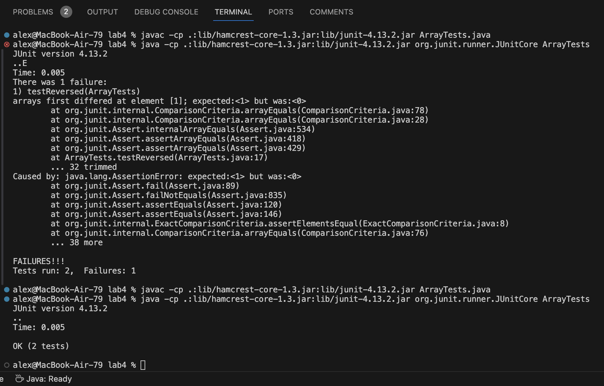

# Lab Report 3
## Part 1
The bug that I chose for part 1 is the bug in the for loop and return statement for the reversed method for ArrayExamples.

Current reversed method:
```
static int[] reversed(int[] arr) {
    int[] newArray = new int[arr.length];
    for(int i = 0; i < arr.length; i += 1) {
      arr[i] = newArray[arr.length - i - 1]; // bug
    }
    return arr; // bug
  }
```
A failure inducing input:
```
@Test
  public void testReversed() {
    int[] input = {3, 2, 1, 0};
    assertArrayEquals(new int[]{0, 1, 2, 3}, ArrayExamples.reversed(input));
  }
```
Input that does not induce failure:
```
@Test
  public void testReversed() {
    int[] input = {0};
    assertArrayEquals(new int[]{0}, ArrayExamples.reversed(input));
  }
```
The symptom being that the array did not reverse correctly and instead had 0 at the index:


The before and after fixing the bug:

Before reversed method:
```
static int[] reversed(int[] arr) {
    int[] newArray = new int[arr.length];
    for(int i = 0; i < arr.length; i += 1) {
      arr[i] = newArray[arr.length - i - 1]; // bug
    }
    return arr; // bug
  }
```
After reversed method:
```
static int[] reversed(int[] arr) {
    int[] newArray = new int[arr.length];
    for(int i = 0; i < arr.length; i += 1) {
      newArray[i] = arr[arr.length - i - 1]; // switched newArray and arr around so that it was not arr being assigned values.
    }
    return newArray; // return the correct array
  }
```
The fix addressed the issue because we were assigning the values of newArray, which was initialized to all 0, into arr which had our inputted values. I also made sure to return the correct array as we were just returning arr again instead of returning the new array that was created.

## Part 2
The command that I am choosing to research is grep.
1. grep -r: What this command is doing is that it recursively searches the given subdirectory and lists each file in the subdirectory with the pattern listed in quotation marks. I found out about this command-line option from using man grep in my terminal.
```
alex@MacBook-Air-79 docsearch % grep -r "Darwin" technical/biomed 
technical/biomed/1471-2105-3-2.txt:        In the 1830's, Charles Darwin's investigation of the
technical/biomed/1471-2105-3-2.txt:        In the 1970's, Woese and Fox revisited Darwinian
```
```
alex@MacBook-Air-79 docsearch % grep -r "Richard" technical/plos 
technical/plos/pmed.0010013.txt:        In 1996, Richard Horton, editor of the 
technical/plos/pmed.0020103.txt:          Cell clusters were fixed in 4% paraformaldehyde, embedded in HistoGel (Richard-Allan
technical/plos/pmed.0020210.txt:        by the international consortium of researchers organized by Dr. Richard Tidwell of the
technical/plos/journal.pbio.0020054.txt:        lowlands, and major wilderness areas. University of Port Elizabeth botanist Richard
technical/plos/pmed.0020206.txt:        doctor's office. As Richard Rockefeller, President of the Health Commons Institute, has
technical/plos/journal.pbio.0030136.txt:        rendered in accurate red-green isoluminance. As discovered by Richard Gregory, form
technical/plos/journal.pbio.0020133.txt:        (Martienssen and Richards 1995). Most intriguing were cases in which silencing seemed to be
technical/plos/pmed.0020226.txt:        Richard Smith's key suggestion [1] is that medical journals “should stop publishing
technical/plos/journal.pbio.0020073.txt:        In 1959 Richard Feynman delivered what many consider the first lecture on
technical/plos/journal.pbio.0020073.txt:        Richard Feynman's 1959 lecture, he quipped, “What are the possibilities of small but
technical/plos/pmed.0010042.txt:        money, and one, former Texas Governor Ann Richards, blatantly promoted Lilly's drug during
technical/plos/journal.pbio.0020306.txt:        Richard Gordon, Professor of Radiology at the University of Manitoba in Winnipeg,
technical/plos/journal.pbio.0020071.txt:        The Blind Watchmaker by Richard Dawkins (1990) is a good introductory
technical/plos/journal.pbio.0020161.txt:        might operate. The group, chaired by Sir Richard Sykes, Rector of Imperial College, London,
```
2. grep -c: This command replaces the regular output for grep and instead provides the count of how many times the pattern in the quotation marks appears in a line from the given file. I found out about this command-line option from using man grep in my terminal.
```
alex@MacBook-Air-79 docsearch % grep -c "The" technical/biomed/1471-2105-3-2.txt
219
```
```
alex@MacBook-Air-79 docsearch % grep -c "in" technical/plos/pmed.0010013.txt
95
```
3. grep -n: This command functions exactly how default grep does except it adds the line number where the pattern is located at, at the end of the filename in output. I found out about this command-line option from using man grep in my terminal.
```
alex@MacBook-Air-79 docsearch % grep -n "Darwin" technical/biomed/*.txt   
technical/biomed/1471-2105-3-2.txt:6:        In the 1830's, Charles Darwin's investigation of the
technical/biomed/1471-2105-3-2.txt:20:        In the 1970's, Woese and Fox revisited Darwinian
```
```
alex@MacBook-Air-79 docsearch % grep -n "Richard" technical/plos/*.txt  
technical/plos/journal.pbio.0020054.txt:225:        lowlands, and major wilderness areas. University of Port Elizabeth botanist Richard
technical/plos/journal.pbio.0020071.txt:58:        The Blind Watchmaker by Richard Dawkins (1990) is a good introductory
technical/plos/journal.pbio.0020073.txt:6:        In 1959 Richard Feynman delivered what many consider the first lecture on
technical/plos/journal.pbio.0020073.txt:106:        Richard Feynman's 1959 lecture, he quipped, “What are the possibilities of small but
technical/plos/journal.pbio.0020133.txt:34:        (Martienssen and Richards 1995). Most intriguing were cases in which silencing seemed to be
technical/plos/journal.pbio.0020161.txt:167:        might operate. The group, chaired by Sir Richard Sykes, Rector of Imperial College, London,
technical/plos/journal.pbio.0020306.txt:48:        Richard Gordon, Professor of Radiology at the University of Manitoba in Winnipeg,
technical/plos/journal.pbio.0030136.txt:92:        rendered in accurate red-green isoluminance. As discovered by Richard Gregory, form
technical/plos/pmed.0010013.txt:6:        In 1996, Richard Horton, editor of the 
technical/plos/pmed.0010042.txt:111:        money, and one, former Texas Governor Ann Richards, blatantly promoted Lilly's drug during
technical/plos/pmed.0020103.txt:89:          Cell clusters were fixed in 4% paraformaldehyde, embedded in HistoGel (Richard-Allan
technical/plos/pmed.0020206.txt:48:        doctor's office. As Richard Rockefeller, President of the Health Commons Institute, has
technical/plos/pmed.0020210.txt:43:        by the international consortium of researchers organized by Dr. Richard Tidwell of the
technical/plos/pmed.0020226.txt:6:        Richard Smith's key suggestion [1] is that medical journals “should stop publishing
```
4. grep -l: This command functions exactly how default grep does except it removes the line where the pattern matched and instead just lists the files where a match with the pattern was found. I found out about this command-line option from using man grep in my terminal.
```
alex@MacBook-Air-79 docsearch % grep -l "Darwin" technical/biomed/*.txt
technical/biomed/1471-2105-3-2.txt
```
```
alex@MacBook-Air-79 docsearch % grep -l "Richard" technical/plos/*.txt 
technical/plos/journal.pbio.0020054.txt
technical/plos/journal.pbio.0020071.txt
technical/plos/journal.pbio.0020073.txt
technical/plos/journal.pbio.0020133.txt
technical/plos/journal.pbio.0020161.txt
technical/plos/journal.pbio.0020306.txt
technical/plos/journal.pbio.0030136.txt
technical/plos/pmed.0010013.txt
technical/plos/pmed.0010042.txt
technical/plos/pmed.0020103.txt
technical/plos/pmed.0020206.txt
technical/plos/pmed.0020210.txt
technical/plos/pmed.0020226.txt
```
